# Milestone Project 1 - Ed Sheeran

My first project was to create a Static Front-End website.  

I have chosen to design a website for Ed Sheeran fans, which displays information about him, some songs and videos, a link to book tickets to his events,
links to his social media accounts, and a contact form to ask any questions and subscribe to newsletters.  

 _**You can access the completed website by [clicking here](https://mattgreen91.github.io/milestone-project-1/index.html) :rocket:**_

The website was created using HTML5, CSS, Bootstrap 4 Framework, and CDN Libraries.

The website has been designed to be fully functional on all devices, including a drop-down mobile navigation menu for small devices.

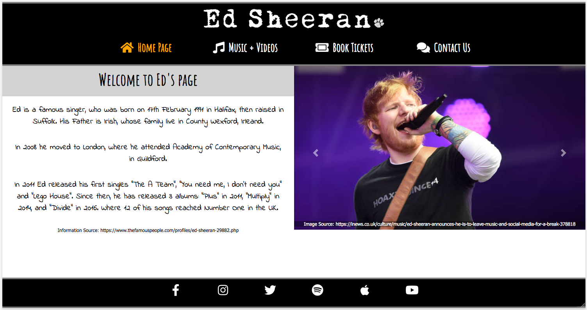 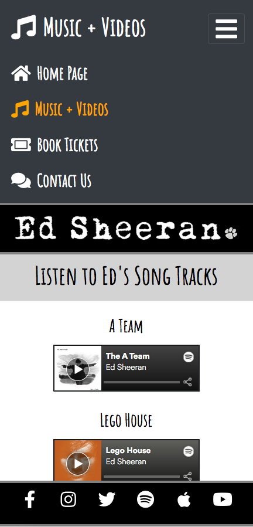 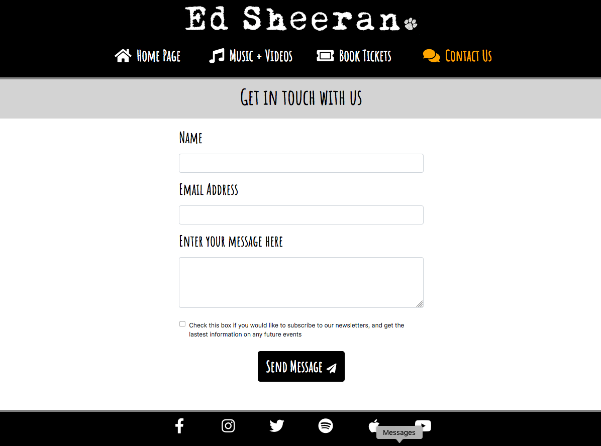
 
## Contents Page

* [1. User Experience (UX)](#1.-user-experience)
* [2. Features](#2.-features)
* [3. Technologies Used](#3.-technologies-used)
* [4. Testing](#4.-testing)
* [5. Deployment](#5.-deployment)
* [6. Credits](#6.-credits)

## 1. User Experience (UX)
 
Use this section to provide insight into your UX process, focusing on who this website is for, what it is that they want to achieve and how your project is the best way to help them achieve these things.

**Purpose**

In particular, as part of this section we recommend that you provide a list of User Stories, with the following general structure:
- As a user type, I want to perform an action, so that I can achieve a goal.

**Design**

This section is also where you would share links to any wireframes, mockups, diagrams etc. that you created as part of the design process. These files should themselves either be included as a pdf file in the project itself (in an separate directory), or just hosted elsewhere online and can be in any format that is viewable inside the browser.

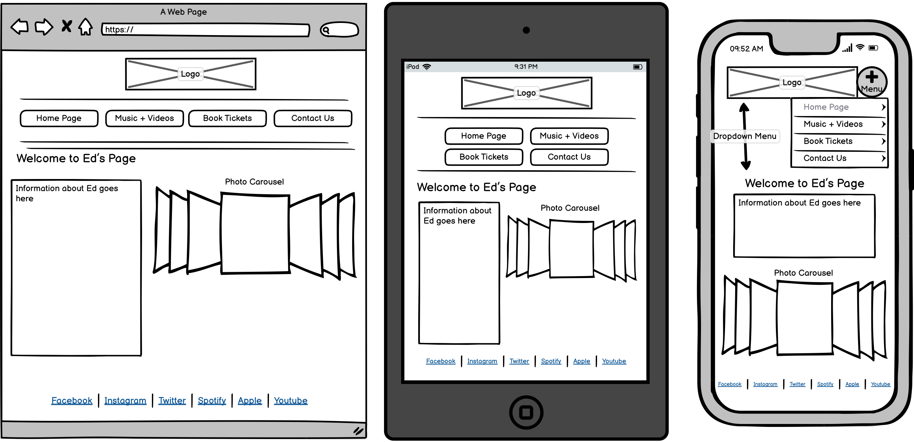

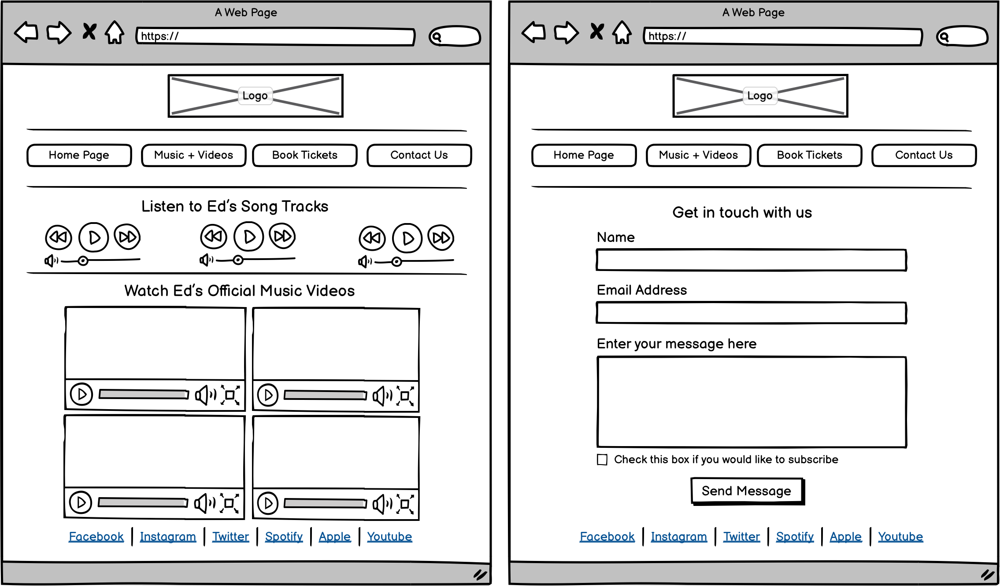

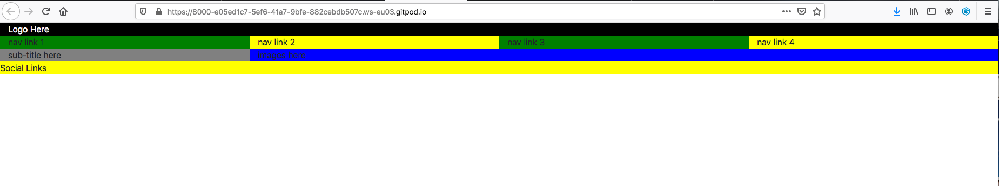

## 2. Features

In this section, you should go over the different parts of your project, and describe each in a sentence or so.
 
### Existing Features
- Feature 1 - allows users X to achieve Y, by having them fill out Z
- ...

For some/all of your features, you may choose to reference the specific project files that implement them, although this is entirely optional.

In addition, you may also use this section to discuss plans for additional features to be implemented in the future:

### Features Left to Implement
- Another feature idea

## 3. Technologies Used

In this section, you should mention all of the languages, frameworks, libraries, and any other tools that you have used to construct this project. For each, provide its name, a link to its official site and a short sentence of why it was used.

- [HTML5](https://html.spec.whatwg.org)
    - The project uses **HTML5** to create the basic structure, text, images and other elements.
- [CSS3](https://www.w3.org/Style/CSS/specs.en.html)
    - The project uses **CSS3** to add customised style to the webpage.
- [Bootstrap 4 Framework](https://getbootstrap.com/docs/4.0/getting-started/introduction)
    - The project uses **Bootstrap 4 Framework** to simplify the layout using Grid System, and customise style with other built-in features.
- [CDN Libraries](https://cdnjs.com/libraries)
    - The project uses **CDN Libraries** which are part of bootstrap, to create the Mobile Navigation Menu, and Photo Carousel.
- [GitPod IDE](https://gitpod.io)
    - The project uses **GitPod IDE** to design, commit and push code into the repository.
- [Font Awesome](https://fontawesome.com/)
    - The project uses **Font Awesome** to add pre-set icons to navigation menu, social links, and form button.
- [Google Fonts](https://fonts.google.com/)
    - The project uses **Google Fonts** to add customised font styles to the webpage.
- [Balsamiq WireFrames](https://balsamiq.com/wireframes/desktop)
    - The project uses **Balsamiq WireFrames** to generate a digital prototype of the webpage before coding.
- [Responsive Viewer Extension - Chrome](https://chrome.google.com/webstore/detail/responsive-viewer/inmopeiepgfljkpkidclfgbgbmfcennb?hl=en)
    - The project uses **Responsive Viewer Extension - Chrome** to easily test the webpage on multiple sized devices at once.
- [HTML5 Validator](https://validator.w3.org)
    - The project uses **HTML5 Validator** to check all the HTML5 code is working, without any errors.
- [CSS3 Validator](https://jigsaw.w3.org/css-validator)
    - The project uses **Responsive Viewer Extension - Chrome** to check all the CSS3 code is working, without any errors.

## 4. Testing

In this section, you need to convince the assessor that you have conducted enough testing to legitimately believe that the site works well. Essentially, in this part you will want to go over all of your user stories from the UX section and ensure that they all work as intended, with the project providing an easy and straightforward way for the users to achieve their goals.

Whenever it is feasible, prefer to automate your tests, and if you've done so, provide a brief explanation of your approach, link to the test file(s) and explain how to run them.

For any scenarios that have not been automated, test the user stories manually and provide as much detail as is relevant. A particularly useful form for describing your testing process is via scenarios, such as:

1. Contact form:
    1. Go to the "Contact Us" page
    2. Try to submit the empty form and verify that an error message about the required fields appears
    3. Try to submit the form with an invalid email address and verify that a relevant error message appears
    4. Try to submit the form with all inputs valid and verify that a success message appears.

In addition, you should mention in this section how your project looks and works on different browsers and screen sizes.

You should also mention in this section any interesting bugs or problems you discovered during your testing, even if you haven't addressed them yet.

[Issues found during creating and testing](assets/readme-files/issues-experienced.pdf)

If this section grows too long, you may want to split it off into a separate file and link to it from here.

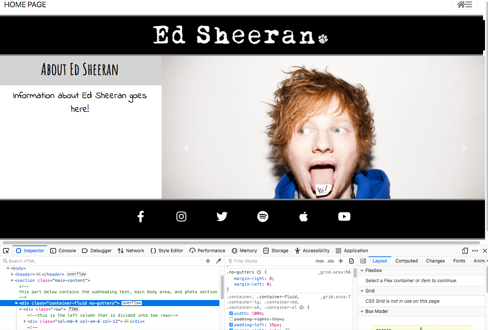

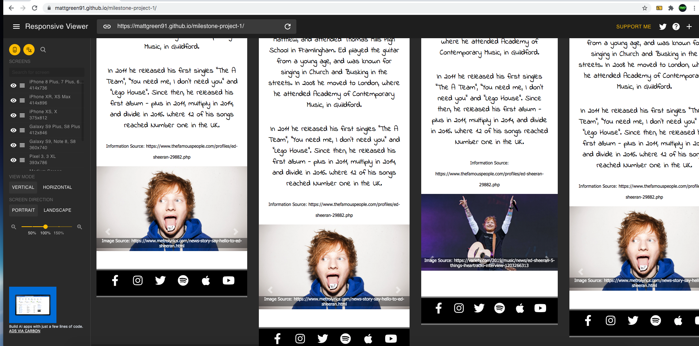

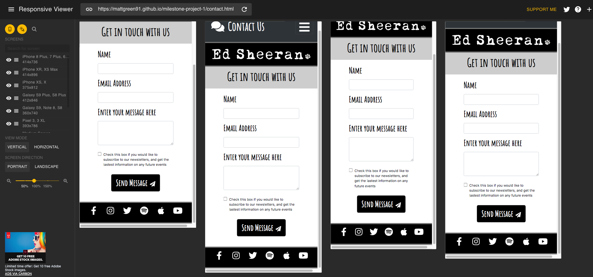

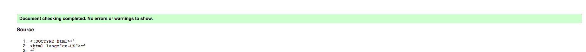

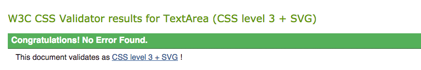

## 5. Deployment

This section should describe the process you went through to deploy the project to a hosting platform (e.g. GitHub Pages or Heroku).

In particular, you should provide all details of the differences between the deployed version and the development version, if any, including:
- Different values for environment variables (Heroku Config Vars)?
- Different configuration files?
- Separate git branch?

In addition, if it is not obvious, you should also describe how to run your code locally.

## 6. Credits

### Content
- The information about Ed Sheeran was sourced from the website [The Famous People](https://www.thefamouspeople.com/profiles/ed-sheeran-29882.php)
- All social links go to his official social media accounts

### Media
- The black logo was taken from [Pinterest](https://www.pinterest.co.uk/pin/718183471806386083/)
- All photos in the photo carousel have source URLs written as captions

### Acknowledgements

- Thanks to Code Institute for training me on the basic tools
- Thanks to my mentor Allen Thomas Varghese for supporting me, and giving some suggestions
- Thanks to Slack Community for helping me fix any glitches

_italic text_

`highlighted text`
