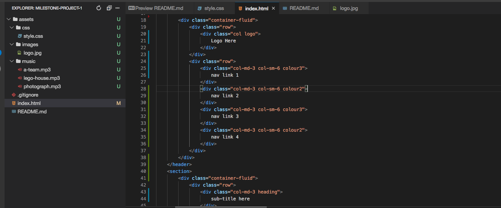
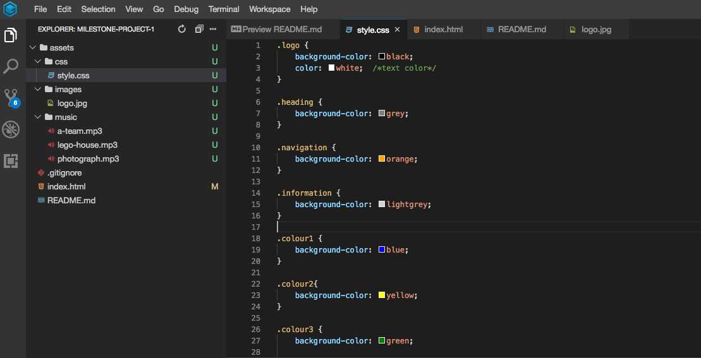

# Milestone Project 1 - Ed Sheeran - by Matt Green

My first project was to create a Static Front-End website.  

I have chosen to design a website for Ed Sheeran fans, which displays information about him, some songs and videos, a link to book tickets to his events,
links to his social media accounts, and a contact form to ask any questions and subscribe to newsletters.  

 _**You can access the completed website by [clicking here](https://mattgreen91.github.io/milestone-project-1/index.html) :rocket:**_

The website was created using HTML5, CSS, Bootstrap 4 Framework, and CDN Libraries.

The website has been designed to be fully functional on all devices, including a drop-down mobile navigation menu for small devices.

  
 
## Contents Page

* [1. UX - User Experience](#1-ux---user-experience)
* [2. Features](#2-features)
* [3. Technologies Used](#3-technologies-used)
* [4. Testing](#4-testing)
* [5. Deployment](#5-deployment)
* [6. Credits](#6-credits)

## 1. UX - User Experience 
 
The Website is predominantly designed for Ed Sheeran Fans.  They are able to listen to his songs and watch his music videos.  They are also able to book tickets for events for his future events, and to subscribe to notifications and newsletters.  They also have links to all his social media accounts. 

The Website is also for those wishing to learn more about Ed Sheeran.  They are able to read information about his family/career history.  They are also able to send a message to find out more information.

**User Stories**

- As a user, I want the website layout to be clear and concise.
- As a user, I want the colours to be appealing but also easy on the eye.
- As a user, I want the navigation to be easy to use, and for me not to get lost in the website.
- As a user, I want all the links to work correctly, and if external - to open in new windows, so I do not get lost.
- As a user, I want some animation to make the website more appealing.
- As a user, I don't want too much text to scroll through.
- As a user, I want all the information to be easy to find.
- As a user, I want all the images to be clear, not pixelised.
- As a user, I want all the sounds and videos to work correctly, and play the correct media source.
- As a user, I want to be able to be able to contact, with the option of subscribing.
- As a user, I want the content to adjust automatically when using multiple screen sizes and devices
- As a user, I want some animation so the page is appealing.

**Design**

This project was designed with Balsamiq Wireframes, which can be seen below:

This project was created with BootStrap Grid System.  Initially coloured cells were used as a guideline to place information in the correct place, as per the WireFrames. 

 

**Accessibility**

The project has many features such as:

* Fall-back fonts, in case Google Fonts are not compatible with the browser
* Alternate Text' attributes for images, in case the images do not display
* Fall-back messages in the iFrames, in case the iFrames are not compatible with the browser
* 'ARIA Hidden' attributes (Accessible Rich Internet Applications), and 'Screen-Reader Only' attributes to make it easier for Screen Readers
* @media Queries, to modify content to fit different sized screens

## 2. Features

The main features of this project are:
 
### Existing Features
- Simplistic Colour Design (black/white/grey) - allows users to see and process information more easily, as the colours are much more appealing to the eye.
- BootStrap Grid System - allows users to view content across multiple sized devices.
- Stylish Font Theme - allows users to feel more engaged by matching similar fonts to Ed Sheeran's writing style.
- Navigation Menu - allows users switch between pages and open Official Ticket Booking Website. Hover animations and Font Awesome icons to add style.
- Mobile Navigation Menu - allows users to save screen space on Mobile Devices by using an animated dropdown menu, so users can see more content.
- Photo Carousel - allows users to view all photos by clicking navigation arrows to make easier, instead of scrolling, but also to add some style.
- Social Media icons - allows users to open Official Social Media accounts in new windows, with hover animations and Font Awesome icons to add style.
- Embedded Spotify tracks - allows users to listen to previews of his soundtracks directly from Spotify, without having to leave the page.
- Embedded YouTube videos - allows users to watch some of his music videos directly from YouTube, without having to leave the page.
- Responsive Contact Form - allows users to send a message with the option of subscribing to newsletters and future event information.

### Features Left to Implement
- The submit button needs to be linked to PHP or SQL severs to work correctly.
- The 'Mobile Navigation Menu' would look nicer in black, but couldn't find this option in BootStrap.

## 3. Technologies Used

In order to construct this project, the below technologies were used: 

- [HTML5](https://html.spec.whatwg.org)
    - The project uses **HTML5** to create the basic structure, text, images and other elements.
- [CSS3](https://www.w3.org/Style/CSS/specs.en.html)
    - The project uses **CSS3** to add customised style to the webpage.
- [Bootstrap 4 Framework](https://getbootstrap.com/docs/4.0/getting-started/introduction)
    - The project uses **Bootstrap 4 Framework** to simplify the layout using Grid System, and customise style with other built-in features.
- [CDN Libraries](https://cdnjs.com/libraries)
    - The project uses **CDN Libraries** which are part of bootstrap, to create the Mobile Navigation Menu, and Photo Carousel.
- [GitPod IDE](https://gitpod.io)
    - The project uses **GitPod IDE** to design, commit and push code into the repository.
- [Pixelmator](https://www.pixelmator.com/pro)
    - The project uses **Pixelmator** to crop and modify image dimensions, to maintain consistency.
- [Font Awesome](https://fontawesome.com/)
    - The project uses **Font Awesome** to add pre-set icons to navigation menu, social links, and form button.
- [Google Fonts](https://fonts.google.com/)
    - The project uses **Google Fonts** to add customised font styles to the webpage.
- [Balsamiq WireFrames](https://balsamiq.com/wireframes/desktop)
    - The project uses **Balsamiq WireFrames** to generate a digital prototype of the webpage before coding.
- [Responsive Viewer Extension - Chrome](https://chrome.google.com/webstore/detail/responsive-viewer/inmopeiepgfljkpkidclfgbgbmfcennb?hl=en)
    - The project uses **Responsive Viewer Extension - Chrome** to easily test the webpage on multiple sized devices at once.
- [HTML5 Validator](https://validator.w3.org)
    - The project uses **HTML5 Validator** to check all the HTML5 code is working, without any errors.
- [CSS3 Validator](https://jigsaw.w3.org/css-validator)
    - The project uses **Responsive Viewer Extension - Chrome** to check all the CSS3 code is working, without any errors.

## 4. Testing

This website has been fully tested and is working correctly.  There were some bugs that I had overcome, which you can see by [clicking here](assets/readme-files/issues-experienced.pdf).

I used the Google Chrome and Mozilla FireFox developer tools to tweak code when testing.

With the advice of my mentor, I downloaded the Google Chrome Extension `Responsive Viewer` which allowed the content to be viewed across multiple devices at the same time, for optimum performance.

The HTML5 Code was put through the official validator, which currently has no errors.

The CSS3 Code was put through the official validator, which currently has no errors.

Main Areas of Testing:

 1. Colours consistent throughout.
 2. Layout consistent, and content moves neatly across multiple screen sizes and devices.
 3. Fonts are consistently sized, and fonts are consistent throughout.
 4. Logo at top is clear, consistent size, and links to home page.
 5. Navigation Menu is consistently sized across all pages, displaying icons, and the colours of the navigation links change to orange colour when mouse hovers over.
 6. Navigation Menu links open correct pages, and 'Book Tickets' opens the Official Booking Page in new window.
 7. Navigation Menu keeps "active page" highlighted in orange.
 8. Social Media Links (footer bar) stays at the bottom of page always.
 9. Social Media Icons change to orange when mouse hovers over, and links open correct websites in new window.
10. Toggle Button for Mobile Navigation Menu brings down navigation links. 
11. Mobile Navigation Menu is fully reponsive with the same steps 5-7 above.
12. Mobile Navigation Icon and Page Name changes according to which page is active.
13. Mobile Navigation Bar moves to the 'top' of the Ed Sheeran Logo, in order to make navigation easier on smaller devices. 
14. Photo Carousel Images are all the same size.
15. Photo Carousel Images are not pixelised.
16. Photo Carousel arrows are working, moving pictures forward and back.
17. Photo Carousel Images have the Image Source location written as caption, clearly over-laying the bottom of the image.
18. Spotify iFrames are consistently same size.
19. Spotify iFrames have the correct song track name as sub-heading, and when pressing play - the correct song plays.
20. Spotify control buttons are all working correctly.
21. YouTube iFrames are consistently same size.
22. Each YouTube video is the correct content (Ed Sheeran Music Video) and plays when play button is pressed.
23. Youtube control buttons are all working correctly.
24. All contact Form text fields glow red and display message "Please fill in this field." when empty and 'Send Message' button is pressed.
25. Contact From 'Email' field glows red and displays message "Plese enter an email address." when incorrect email format typed (i.e. no @ symbol).
26. Contact form can be submitted without the 'checkbox' being checked, as this is an optional choice.
27. 'Send Message' button displays 'paper plane' icon.
28. When the form is complete, and the 'Send Message' button is pressed, the page will clear the data.
29. All content on all pages is clearly visible on all screen sizes, using [Responsive Viewer](https://chrome.google.com/webstore/detail/responsive-viewer/inmopeiepgfljkpkidclfgbgbmfcennb?hl=en) (Google Chrome Extension).
30. All HTML5 and CSS3 code run through official W3C validator.

## 5. Deployment

This project was created using GitPod IDE which was recommended by Code Institute.  The reason for choosing this IDE is because it is all online, so no additional software needs to be installed, and the project can be accessed and edited on any workstation, as long as internet is available.

Code Institute had provided an Initial Template which included all the relevent extensions to aid with my project. The template can be accessed by [clicking here](https://github.com/Code-Institute-Org/gitpod-full-template).

For ease, I downloaded the GitPod [Google Chrome extension](https://chrome.google.com/webstore/detail/gitpod-dev-environments-i/dodmmooeoklaejobgleioelladacbeki?hl=en) and [Mozilla Firefox extension](https://addons.mozilla.org/en-GB/firefox/addon/gitpod/).  By doing this, a green Gitpod button appears on the project's GitHub page - linking the project directly to the workspace.

The CLI (Command Line Interface) is built into GitPod, which means no additional software needs to be downloaded.

The process for adding/modifying/removing content is as per below:

`git add "file-name-1.ext"` _to add the first new/modified file to the staging area_

`git add "file-name-2.ext"` _to add the second new/modified file to the staging area_

Once all files have been added/updated then...

`git commit -m "commit message goes here"` _the commit message needs to be entered inside the inverted commmas " "_

`git push` _this commmand push the content into the GitHub repository_

When there are multiple files, it can take a long time to add all modifications, so instead I used a shortcut:

`git status`  _to view all status changes_

`all modifications will now be listed here on the CLI`

`git add .`  _the . means 'all above', so this command will update all changes_

`git commit -m "commit message goes here"`  _commit message needs to be entered inside the inverted commas " "_

`git push`  _this commmand push the content into the GitHub repository_

Code Institute also provided a [Readme Template](https://github.com/Code-Institute-Solutions/readme-template) which I used as a guideline for creating this Readme file.

The project can be opened by [clicking here](https://mattgreen91.github.io/milestone-project-1/index.html)

## 6. Credits

### Content
- The information about Ed Sheeran was sourced from the website [The Famous People](https://www.thefamouspeople.com/profiles/ed-sheeran-29882.php).
- All social links go to his official social media accounts.
- Mobile Navigation Menu was made with the help of [MD BootStrap](https://mdbootstrap.com/docs/standard/navigation/navbar).
- Hiding Divs was done with the help of [BootStrap](https://getbootstrap.com/docs/4.0/utilities/display).
- Flex displaying was done with the help of [Coder Coder](https://coder-coder.com/how-to-center-button-with-html-css).

### Media
- The black logo was taken from [Pinterest](https://www.pinterest.co.uk/pin/718183471806386083/).
- The photo carousel was made with the help of [BootStrap](https://getbootstrap.com/docs/4.3/components/carousel).
- All photos in the photo carousel have source URLs written as captions.
- Spotify Embedding was taken from [Spotify](https://developer.spotify.com/documentation/widgets/generate/embed).
- YouTube Embedding was taken from [YouTube](https://www.youtube.com) individual music videos directly.

### Acknowledgements

- Thanks to Code Institute for training me on HTML5, CSS and BootStrap 4.
- Thanks to my mentor Allen Thomas Varghese for supporting me, and giving some ideas - such as the Mobile Navigation Menu.
- Thanks to Slack Community for helping me solve any issues with code not working.
- Thanks to Code Institute for helping me fix any glitches that I came across.
